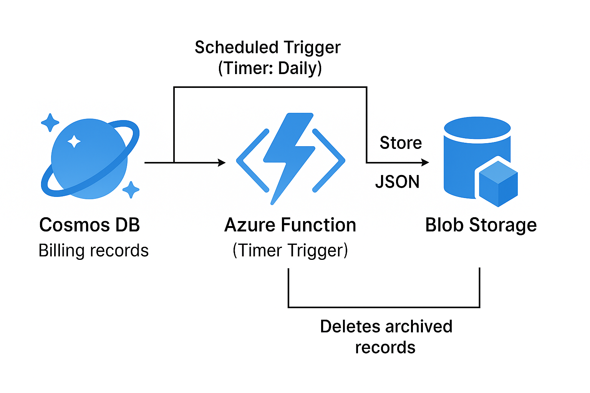

# 💼 Azure Cost Optimization: Archive Billing Data from Cosmos DB to Blob Storage

[](#)
[](#)
[](#)

This project automates the archival of billing data from **Azure Cosmos DB** to **Azure Blob Storage** using an **Azure Function App** scheduled via a timer trigger. All resources are deployed using **Terraform**.

---

## 👩‍💼 Project Summary

This solution provisions Azure infrastructure using Terraform to create a Cosmos DB, Storage Account, and Azure Function App running PowerShell scripts. The Azure Function archives Cosmos DB billing records older than 3 months to Blob Storage and deletes them from Cosmos DB to optimize costs.

Key highlights include:

- **Infrastructure as Code (IaC)** with Terraform for consistent resource provisioning.  
- **Secure secret management** by passing Cosmos DB primary key as a sensitive Terraform variable (`variables.tf`).  
- **PowerShell-based Azure Function** implementing retry logic and error handling.  
- **Timer-triggered automation** configurable via CRON expression.  
- Cost savings achieved by offloading cold data from Cosmos DB to cheaper Blob Storage.  
- Clear separation of concerns and modular project structure.

---

## 🛠️ Prerequisites

Before you begin, ensure you have the following:

- [Terraform](https://developer.hashicorp.com/terraform/downloads) installed
- [Azure CLI](https://learn.microsoft.com/en-us/cli/azure/install-azure-cli) installed and logged in
- Active Azure subscription with contributor access

---

## 📌 Features

- Provisioning of Azure resources using Terraform
- PowerShell-based Azure Function to move old billing data
- Daily scheduled trigger (adjustable) using `function.json`
- Archived files saved in Azure Blob Storage
- Helps reduce costs by offloading old data from Cosmos DB

---

## 💡 What This Project Includes

- **Terraform scripts** to create:
  - Resource Group
  - Cosmos DB
  - Storage Account
  - Azure Function App

- **Azure Function** (PowerShell script):
  - Runs on a schedule (every day)
  - Reads old billing records from Cosmos DB
  - Stores them in a Storage container as JSON files

---

## 🏗️ Architecture Diagram

The following diagram illustrates the high-level design of the archival and restore solution using Azure services:



### 🔄 Flow Overview

- **Cosmos DB** stores the primary data.
- **Azure Function App** is triggered (time-based or event-based) to archive data from Cosmos DB.
- **Blob Storage** is used to store archived data in JSON format.
- Another **Azure Function** or ADF pipeline can be used to **restore** data back to Cosmos DB if needed.
- Monitoring and automation (e.g., Azure Monitor, Runbooks) can be configured optionally.

---

## 🧱 Project Structure

```
📁 azure-cost-optimization-assignment/
├── 📄 main.tf               # Azure provider setup and Resource Group creation
├── 📄 storage.tf            # Azure Storage Account and Blob Container configuration
├── 📄 cosmosdb.tf           # Azure Cosmos DB provisioning for billing records
├── 📄 functionapp.tf        # Azure Function App infrastructure deployment
├── 📄 variables.tf          # Terraform variable for Cosmos DB primary key (sensitive)
├── 📄 README.md             # Project documentation and instructions
├── 📁 archive-function/
│   ├── 📄 archive-billing.ps1  # PowerShell script to archive Cosmos DB records to Blob Storage
│   └── 📄 function.json         # Timer trigger schedule configuration for the Azure Function
└── 📁 assets/
    └── 📄 architecture.png      # High-level architecture diagram of the solution
```

---

## 💡 Function Logic – Pseudocode Summary

```powershell
Every 24 hours (via timer trigger):
  Connect to Cosmos DB using connection string (from App Settings)
  Query for billing records older than 3 months
  For each record:
    Convert to JSON format
    Try to upload as a blob to Azure Blob Storage (into the archive container)
    If upload is successful:
      Delete the record from Cosmos DB
    Else:
      Retry upload a set number of times
      If still failing after retries:
        Log failure for manual review
Log overall success/failure for auditing
```

* The logic is implemented in `archive-billing.ps1` and triggered by `function.json`.
* Designed for cost reduction by archiving cold data to cheaper Blob storage.

---

## 🔐 Managing Secrets and Configuration

Sensitive information such as Cosmos DB primary key is handled securely using Terraform variables defined in `variables.tf`:

```hcl
variable "cosmosdb_primary_key" {
  description = "The primary key for accessing Cosmos DB"
  type        = string
  sensitive   = true
}
```

During deployment, provide the primary key via CLI or environment variables without hardcoding secrets in the code:

```bash
terraform apply -var "cosmosdb_primary_key=YOUR_COSMOS_DB_PRIMARY_KEY"
```

- Secrets are passed as application settings to the Azure Function App to be accessed as environment variables inside the PowerShell script.

- Consider using Azure Managed Identities and Azure Key Vault for production scenarios to eliminate direct secret handling.

---

## 🚀 How to Use

### Step 1: Deploy Infrastructure

1. Open your terminal and navigate to the project root directory.
2. Run `terraform init` to initialize Terraform.
3. Run `terraform plan` to review planned changes.
4. Run `terraform apply` to apply changes and create resources.
5. Confirm with `yes` when prompted.

### Step 2: Deploy Azure Function Code

1. In Azure Portal, go to your Function App → Functions → select your function → Code + Test tab.
2. Upload or replace these files:
   - `archive-billing.ps1`
   - `function.json`
3. Navigate to the Configuration tab in your Function App.
4. Add a new Application Setting:
   - **Key:** `CosmosDBConnection`
   - **Value:** Your Cosmos DB connection string (from Azure Portal)
     > *Find Cosmos DB connection string under Azure Portal → Your Cosmos DB → Keys*

> **Security Tip:** Do **not** hardcode connection strings inside your PowerShell script.

### Step 3: Monitor & Schedule

1. The Azure Function runs automatically every 24 hours, controlled by `function.json`.
2. Modify the schedule by editing the CRON expression in `function.json`.
3. Monitor function executions and logs in Azure Portal under Monitoring or Application Insights.
> **Note:**  
> Regularly check the Azure Function App logs in the Azure Portal to monitor for any failures or errors during archival.  
> Consider setting up Azure Monitor alerts or Application Insights alerts to get notified proactively if the function fails or encounters issues.

### 📊 Monitoring & Alerts

It is recommended to enable **Application Insights** for the Function App to monitor execution logs, failures, and performance metrics. Alerts can be configured based on failure counts, execution time anomalies, or other custom metrics to proactively notify you of potential issues.

### Step 4: Verify Archival

1. Check that billing records older than 3 months have been archived to Blob Storage.
2. Confirm these records are deleted from Cosmos DB.
3. Review Function App logs for errors or warnings.

---

## 🔔 Azure Function Timer Trigger Configuration
The archival process runs automatically based on a **Timer Trigger** configured in the `function.json` file inside the Azure Function App’s code directory.

- The `function.json` contains a CRON expression which defines the schedule (e.g., daily).

- You can customize the timer schedule by editing this CRON expression directly.

- Optionally, you can set the schedule dynamically using an **App Setting** by referencing it within `function.json` like this:

```json
"schedule": "%ScheduleAppSetting%"
```

- For manual or ad hoc executions, the function can be triggered via the Azure Portal or by invoking it through HTTP API with proper authorization.

> *You can also manually trigger the Azure Function directly from the Azure Portal or by sending an authenticated HTTP POST request to the function URL. This is useful for testing or running the archive process on demand outside the normal schedule.*

### Additional Details and References

- [Microsoft docs on timer trigger](https://learn.microsoft.com/en-us/azure/azure-functions/functions-bindings-timer) – Official documentation on configuring and using timer triggers in Azure Functions.
- [Manual triggering approach](https://kumarashwinhubert.com/azure-timer-function-how-to-force-immediate-execution-with-manual-triggering) – Guide on how to manually trigger Azure timer functions for testing or immediate execution.

---

## 🧪 Testing and Validation

Due to the lack of an active Azure subscription, this solution has been developed and reviewed based on best practices, architecture principles, and local environment testing (where applicable).  
Full end-to-end deployment and execution testing on Azure infrastructure is pending and will be completed once subscription access is available.

---

## 🧹 Cleanup

- To avoid ongoing charges, destroy all created Azure resources using:

```bash
terraform destroy
```

* Confirm the deletion by typing "yes" when prompted. This will clean up all resources provisioned by Terraform.

---

## 🔒 Security Considerations

* Store sensitive information such as connection strings in Azure Function App Application Settings rather than hardcoding them in scripts.

* For production environments, use Azure Managed Identities combined with Azure Key Vault to securely manage secrets.

* Never commit secrets or credentials to your GitHub repository, especially public ones.

* Regularly review and rotate access keys to minimize risk.

---

## 📦 Output

* This project ensures that billing records older than 3 months are safely archived as JSON files in Azure Blob Storage.

* Cosmos DB storage size and related costs are significantly reduced, without impacting data availability or API contracts.

---

## 👩‍💼 Author

**Sai Suneetha**

Azure DevOps Engineer

[LinkedIn](https://www.linkedin.com/in/sunneetha/)

---

## 📄 License

* This project is provided “as-is” for demonstration purposes.
* Please review and enhance security before deploying to production environments.
